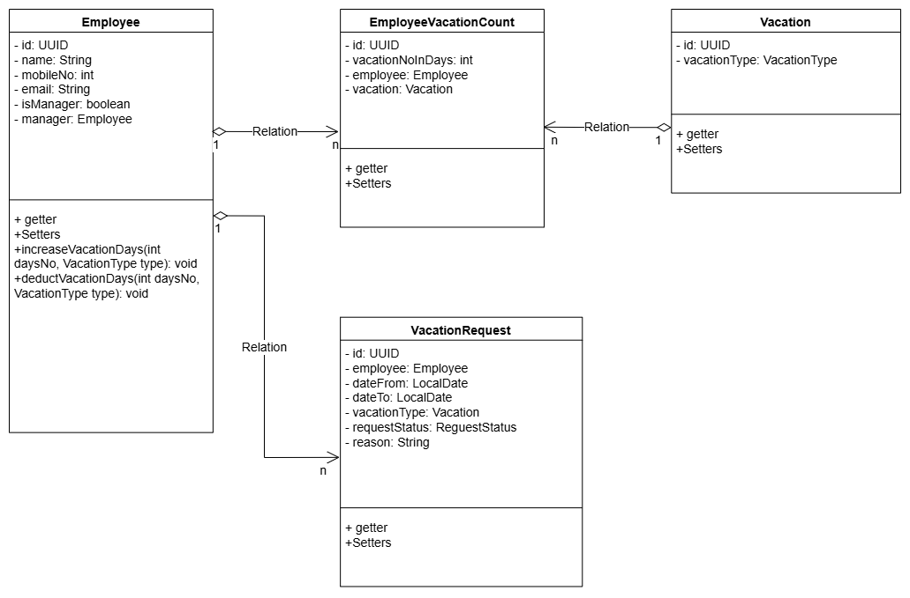
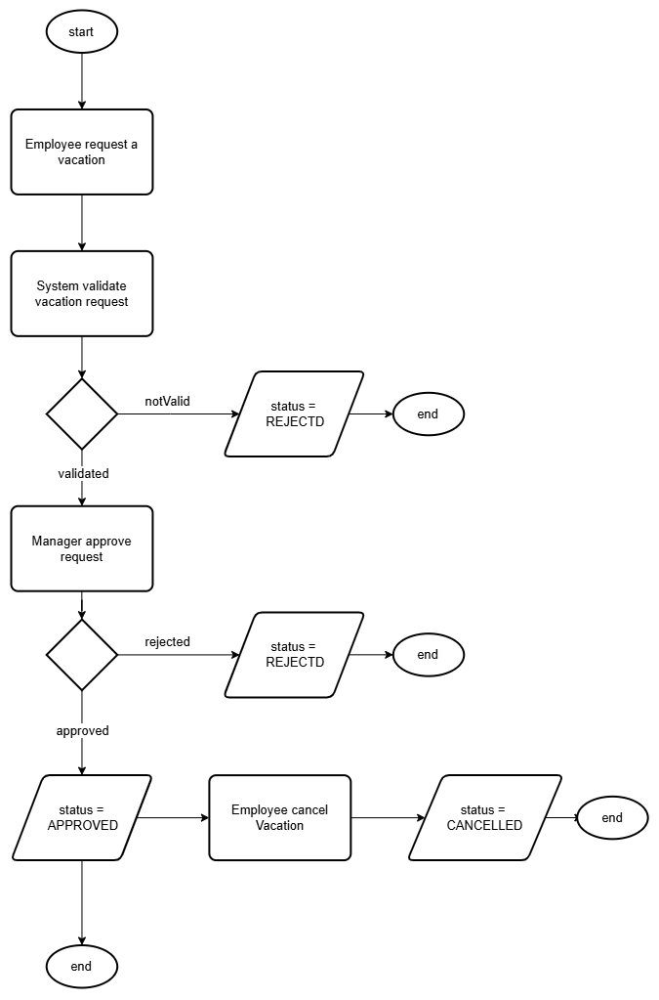
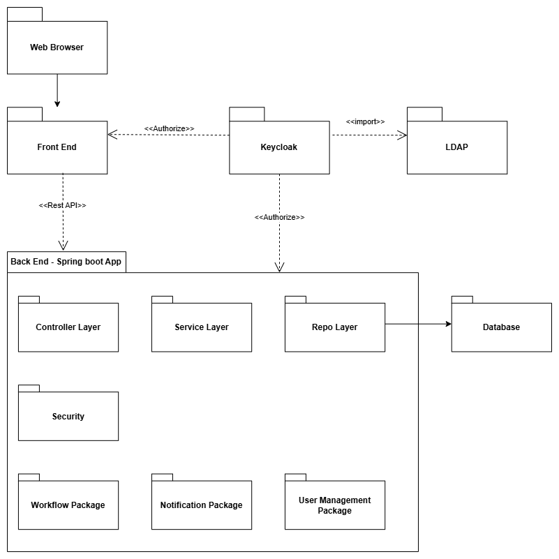

## Architectural design for Vacation Tracking System (VTS)

This document show the proposed design and system Architectural for Vacation Tracking System (VTS) Online Website application.

The system must have at least capabilities:

System allows employees to insert requested vacation.

System automatically validate vacation request based on allowed vacation days, type of vacation company polices and country labor laws.

System automatically calculate the remaining allowed vacation days per vacation type for each employee and shown in the system. 

System allows HR admin/clerk to insert this polices, lows and any other exemptions or special rules. Example: rewarded vacation.

System provide automatic workflow which reflect company polices and procedures regarding vacation request and approval. 

System provide notifications sent to employees and managers regarding approval, reject, cancelation and withdrawal.

## System Actors

| Actor | Use Case | Description |
| --- | --- | --- |
| **Employee** | Manage Time | Describes how employees request and view their own vacation time requests and outstanding balances. |
| **Manager** | Approve Request | Describes how a manager responds to (approves or denies) a subordinate’s request for vacation time. |
| **Manager** | Award Time | Describes how a manager can award a subordinate extra leave time (comp time), subject to system-set limits. |
| **Clerk** (HR Clerk) | Edit Employee Record | Describes how an HR clerk edits employee information, including setting leave time allowances and maximum awardable time. |
| **Clerk** (HR Clerk) | Manage Locations | Describes how an HR clerk manages specific location records and the unique rules associated with them. |
| **Clerk** (HR Clerk) | Manage Leave Categories | Describes how an HR clerk manages different leave categories and their specific validation rules. |
| **Clerk** (HR Clerk) | Override Leave Records | Describes how an HR clerk may manually override a rejection of a leave time request generated by the system’s rules. |
| **System Admin** | Back Up System Logs | Describes how the system administrator collects and archives the system's technical log files |

The main focus will be employee Manage Time use case.

### Package Diagram

### Flow Diagram

### Entity Diagram
