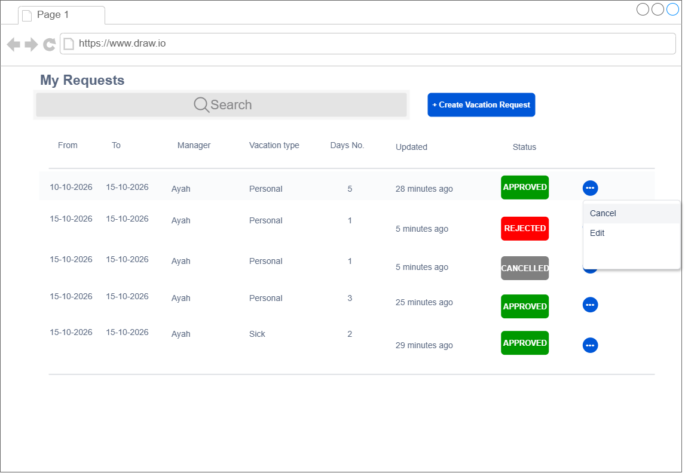
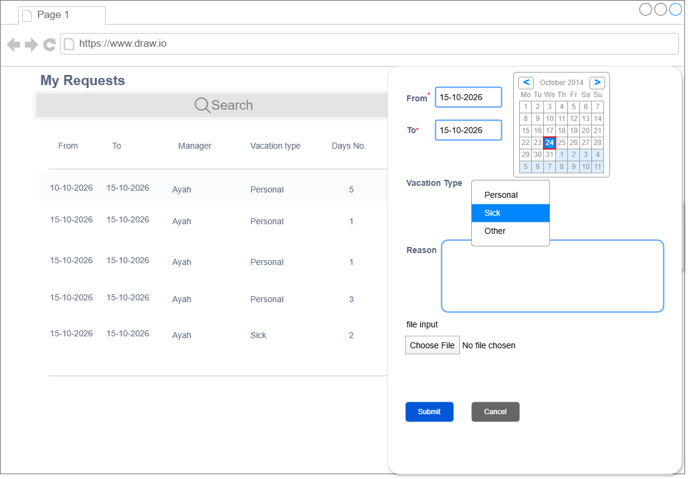
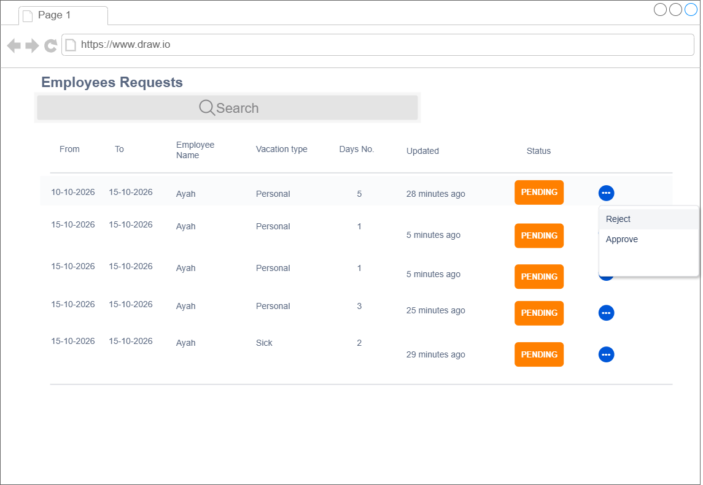
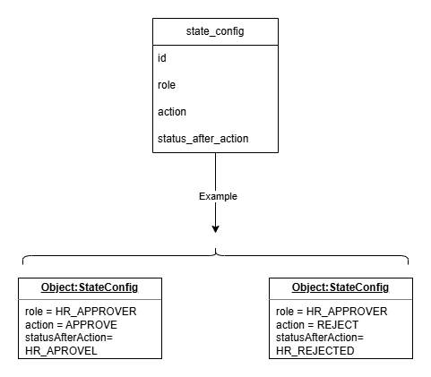
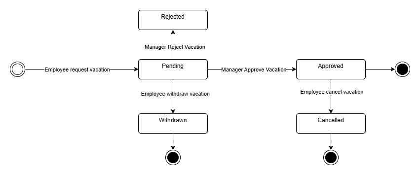
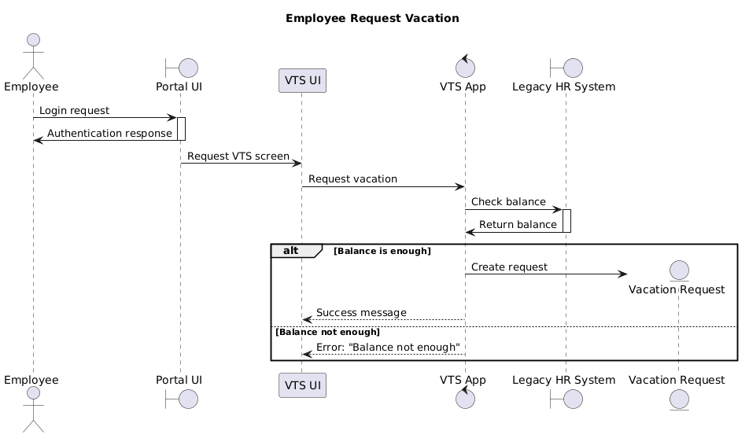
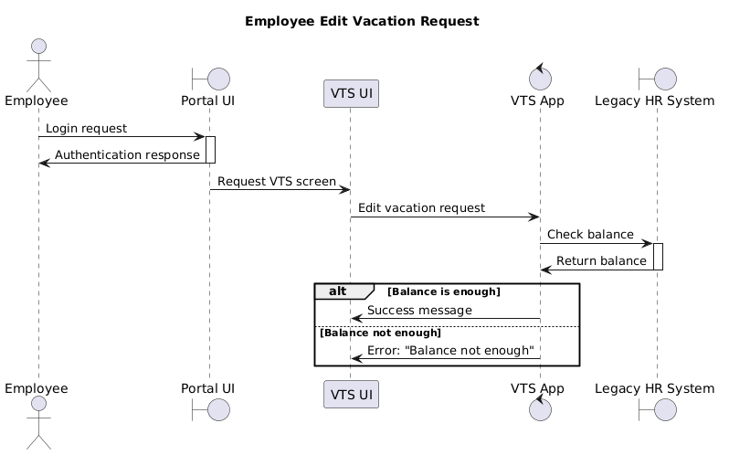
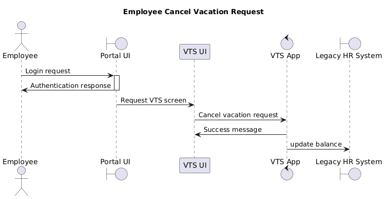
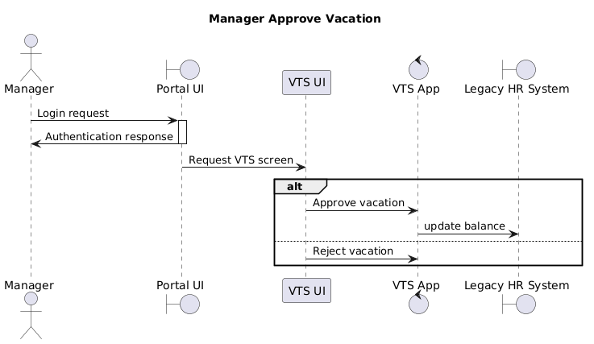

## Task 1 - UI

### Employee Request Table View


### Employee Request Vacation Table


### Mangar Table View


## Add new Status with minimum change

To be able to add a table with minimum change , adding status and the action that lead to that status is configurable.
To be able to achieve that two different component must be added:
1. State Configuration UI
2. State Configuration Controller, Service, Repository

**Suggested State Configuration Table Design**



##  pseudo-code 


```
public void performAction(String action, EmployeeRequestDto dto) {
    String user = getCurrentUserFromJwt();
    stateConfigService.validateAction(action).orElseThrowException;
    String status = stateConfigService.getStatus(user, action);
    EmployeeRequest req = Mapper.toEntity(dto);
    req.setStatus()
    employeeRequestRepo.save(req);
 ```

## state machine of the request


## sequence diagram of the request









