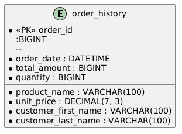

##  DB schema
### ER diagram and relationships


### DB Schema creation
```sql
CREATE TABLE category(
    category_id BIGINT PRIMARY KEY,
    category_name VARCHAR(100) NOT NULL
);

CREATE TABLE Product(
    product_id BIGINT PRIMARY KEY,
    
    name VARCHAR(100),
    description TEXT,
    price DECIMAL(7, 3),
    stock_quantity BIGINT,
    category_id BIGINT,
    
    CONSTRAINT fk_category_id FOREIGN KEY (category_id) 
    REFERENCES category(category_id) ON UPDATE CASCADE
);

CREATE TABLE Customer(
    customer_id BIGINT PRIMARY KEY,
    
    first_name VARCHAR(100),
    last_name VARCHAR(100),
    email VARCHAR(100),
    password VARCHAR(100)
);

CREATE TABLE Order(
    order_id BIGINT PRIMARY KEY,
    order_date DATETIME,
    total_amount BIGINT
    
    customer_id BIGINT ,  

    created_at DATETIME DEFAULT CURRENT_TIMESTAMP,
    updated_at DATETIME DEFAULT CURRENT_TIMESTAMP ON UPDATE CURRENT_TIMESTAMP,

    CONSTRAINT fk_customer_id FOREIGN KEY (customer_id)
        REFERENCES Customer(customer_id) ON DELETE CASCADE
);

CREATE TABLE Order_details(
    id BIGINT PRIMARY KEY,
    
    unit_price DECIMAL(7, 3),
    quantity BIGINT
    
    order_id BIGINT,  
    order_id BIGINT,
    
    created_at DATETIME DEFAULT CURRENT_TIMESTAMP,
    updated_at DATETIME DEFAULT CURRENT_TIMESTAMP ON UPDATE CURRENT_TIMESTAMP,

    CONSTRAINT fk_order_id FOREIGN KEY (order_id)
    REFERENCES order(order_id) ON UPDATE CASCADE
    
    CONSTRAINT fk_product_id FOREIGN KEY (product_id)
    REFERENCES product(product_id) ON UPDATE CASCADE
);
```

##  Write an SQL query to generate a daily report of the total revenue for a specific date.`

```sql
SELECT SUM(total_amount)
FROM Order
WHERE order_date BETWEEN :startOfDay AND :endOfDay

```

## Write an SQL query to generate a monthly report of the top-selling products in a given month.`

```sql
SELECT p.name, SUM(od.quantity) as total_quantity
FROM Order o
LEFT JOIN Order_details od
ON o.order_id = od.order_id
LEFT JOIN Product p
ON od.product_id = p.product_id
WHERE o.order_date BETWEEN :startOfMonth AND :endOfMonth
ORDER BY total_quantity
LIMIT 1;

```

## Write a SQL query to retrieve a list of customers who have placed orders totaling more than $500 in the past month. Include customer names and their total order amounts. [Complex query].`

```sql
SELECT c.first_name,c.last_name,SUM(o.total_amount), SUM(od.quantity) as total_quantity
FROM Order o
LEFT JOIN Order_details od
ON o.order_id = od.order_id
LEFT JOIN Product p
ON od.product_id = p.product_id
LEFT JOIN Customer c
ON od.product_id = p.product_id
GROUP BY c.first_name,c.last_name
HAVING o.total_amount > 500;

```

## How we can apply a denormalization mechanism on customer and order entities.
When the order finalized, the order pretty much stabilized.
We could move all information regarding one order (including information form tables: customer, order details and product) to one denormalized table (order_history)
This table will be used for analytics and dashboards, and will be more efficient because it will be denormalized.




